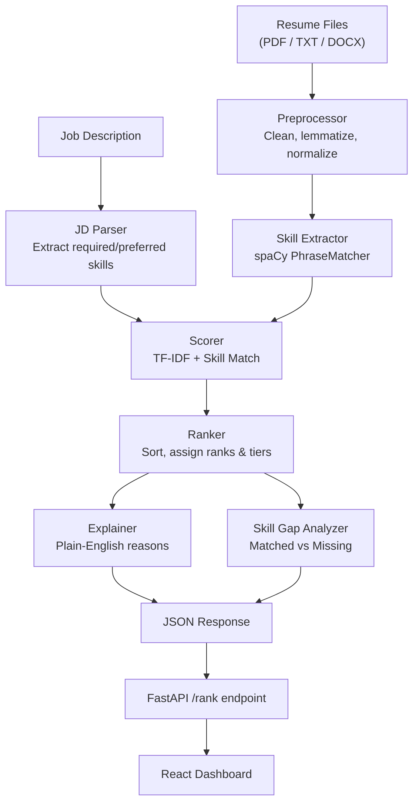

# Resume Screening & Ranking System

**AI-powered resume screening that scores, ranks, and explains — built for recruiters who value transparency.**

[](https://python.org)
[](https://fastapi.tiangolo.com)
[](https://react.dev)
[](https://scikit-learn.org)
[](https://spacy.io)
[](LICENSE)


## Overview

Recruiters often review hundreds of resumes for a single opening. Manual screening is slow, inconsistent, and prone to bias. This system automates the initial screening stage:

1. **Parses** the job description to extract required and preferred skills
2. **Extracts** skills from each resume using a curated NLP taxonomy (~200 skills across 9 categories)
3. **Scores** each candidate using a transparent, weighted formula combining text similarity and skill coverage
4. **Ranks** candidates with tier labels (Strong / Moderate / Weak Match)
5. **Explains** every score in plain English — no black boxes

The tool is designed to **support** recruiters, not replace them. It handles the tedious first pass so humans can focus on the shortlisted candidates.

---

## Features

| Feature | Description |
|---------|-------------|
| **Resume Cleaning** | Strips URLs, emails, phone numbers, and noise before analysis |
| **NLP Skill Extraction** | spaCy PhraseMatcher with a curated taxonomy + noun-phrase fallback |
| **JD Parsing** | Detects "Required Skills" and "Preferred Skills" sections automatically |
| **TF-IDF Similarity** | Cosine similarity captures vocabulary alignment beyond keywords |
| **Weighted Scoring** | Configurable formula — adjust weights for your hiring priorities |
| **Candidate Ranking** | Sorted results with competition-style tie handling |
| **Skill Gap Analysis** | Shows exactly which required/preferred skills each candidate is missing |
| **Plain-English Explanations** | Every score comes with a human-readable explanation |
| **Candidate Comparison** | Side-by-side comparison of up to 3 candidates |
| **File Upload** | Supports PDF, DOCX, and TXT resume formats |
| **Dark Mode** | System-aware with manual toggle |
| **REST API** | FastAPI with auto-generated Swagger docs at `/docs` |

---

## How It Works



---

## Scoring — How It Works

### The Formula

```
Final Score = (
    0.15 × Text Similarity      +
    0.60 × Required Skills Match +
    0.25 × Preferred Skills Match
) × 100
```

| Component | Weight | What It Measures |
|-----------|--------|------------------|
| **Text Similarity** | 15% | TF-IDF cosine similarity between resume and JD. Captures overall vocabulary alignment — a resume that *discusses* "deployed ML models on AWS" scores higher than one that merely lists "AWS". |
| **Required Skills** | 60% | Percentage of must-have skills found in the resume. This is the highest weight because required skills are the hard filter recruiters care about most. |
| **Preferred Skills** | 25% | Percentage of nice-to-have skills found. Weighted lower because these are differentiators, not dealbreakers. |

> Weights are configurable in [`backend/src/config.py`](backend/src/config.py). They must sum to 1.0.

### Worked Example

**Candidate: Alice Chen** applying for **Senior Data Scientist**

| Component | Raw Value | Weighted |
|-----------|-----------|----------|
| Text Similarity | 82% → 0.82 | 0.15 × 0.82 = 0.123 |
| Required Skills | 9/10 matched → 0.90 | 0.60 × 0.90 = 0.540 |
| Preferred Skills | 4/7 matched → 0.57 | 0.25 × 0.57 = 0.143 |
| **Final Score** | | **(0.123 + 0.540 + 0.143) × 100 = 80.6** |

**Why Alice ranks high:** She covers 90% of the required skills *and* her resume language naturally aligns with the JD (high text similarity). She's missing 1 required skill and 3 preferred skills, but the strong coverage of essentials keeps her score above 70 — earning a "Strong Match" tier.

### How Missing Skills Are Identified

1. The JD parser segments the job description into "Required" and "Preferred" sections using header patterns
2. The skill extractor runs on the resume using the same taxonomy
3. Set difference: `missing = JD_skills − resume_skills`
4. Results clearly separate missing *required* skills (dealbreakers) from missing *preferred* skills (nice-to-haves)

### Tier Labels

| Tier | Score Range | Meaning |
|------|-------------|---------|
| Strong Match | ≥ 70 | Candidate matches most requirements |
| Moderate Match | 45 – 69 | Partial match, worth a closer look |
| Weak Match | < 45 | Significant gaps relative to the role |

---

## Sample Results

**Job Description:** Senior Data Scientist  
**10 sample resumes ranked against the Data Scientist JD:**

| Rank | Candidate | Score | Tier | Key Strengths | Notable Gaps |
|------|-----------|-------|------|---------------|--------------|
| 1 | Jake Anderson | ~82 | Strong Match | Python, ML, TensorFlow, NLP, leadership | — |
| 2 | Alice Chen | ~80 | Strong Match | Python, scikit-learn, pandas, A/B testing | Minor preferred gaps |
| 3 | David Park | ~78 | Strong Match | NLP, deep learning, PyTorch, spaCy | Some required skills |
| 4 | Frank Liu | ~55 | Moderate Match | TensorFlow, deep learning, Python | Missing SQL, statistical analysis |
| 5 | Iris Thompson | ~50 | Moderate Match | scikit-learn, NLTK, pandas | Entry-level, no production experience |
| 6 | Grace Kim | ~42 | Weak Match | Python, SQL, Apache Spark, Airflow | Data engineering focus, not DS |
| 7 | Henry Wilson | ~35 | Weak Match | Python, FastAPI, REST API | Backend focus, no ML skills |
| 8 | Bob Martinez | ~20 | Weak Match | JavaScript, React, Node.js | Web dev, no data science skills |
| 9 | Eva Rodriguez | ~18 | Weak Match | AWS, Docker, Kubernetes | DevOps focus, no ML |
| 10 | Carol Johnson | ~30 | Weak Match | Python, SQL, pandas | Junior analyst, limited ML |

> Scores are approximate. Run the pipeline yourself with `python demo.py` in the `backend/` directory to get exact numbers.

---

## Tech Stack

| Technology | Purpose |
|------------|---------|
| **Python 3.10+** | Backend language |
| **FastAPI** | REST API framework with automatic OpenAPI docs |
| **spaCy** | NLP pipeline — PhraseMatcher for skill extraction |
| **NLTK** | Tokenization, lemmatization, stopword removal |
| **scikit-learn** | TF-IDF vectorization and cosine similarity |
| **pandas / numpy** | Data manipulation |
| **pdfplumber** | PDF text extraction |
| **React 19** | Frontend UI framework |
| **Vite** | Frontend build tool and dev server |
| **Tailwind CSS 4** | Utility-first CSS framework |
| **Recharts** | Data visualization in the dashboard |
| **Lucide React** | Icon library |

---

## Project Structure

```
resume-screening-system/
├── backend/
│   ├── src/
│   │   ├── config.py              # Weights, paths, constants
│   │   ├── preprocessing.py       # Text cleaning and lemmatization
│   │   ├── skill_extractor.py     # spaCy PhraseMatcher + noun-phrase fallback
│   │   ├── jd_parser.py           # Parse JD → required/preferred/experience
│   │   ├── scorer.py              # TF-IDF cosine + skill-match scoring
│   │   ├── ranker.py              # Sort candidates, assign ranks & tiers
│   │   ├── skill_gap.py           # Matched / missing skill analysis
│   │   └── explain.py             # Plain-English explanation generator
│   ├── skills/
│   │   └── skills_taxonomy.json   # ~200 skills across 9 categories
│   ├── tests/
│   │   └── test_pipeline.py       # Unit tests for all modules
│   ├── api.py                     # FastAPI REST endpoints
│   ├── demo.py                    # Quick end-to-end demo script
│   └── requirements.txt           # Python dependencies
├── frontend/
│   ├── src/
│   │   ├── components/            # React UI components (10 modules)
│   │   ├── hooks/useScreening.js  # Custom hook for pipeline state
│   │   ├── utils/api.js           # Backend API service
│   │   ├── App.jsx                # Root component
│   │   └── config.js              # Frontend configuration
│   ├── index.html
│   ├── package.json
│   └── vite.config.js
├── notebooks/
│   ├── 01_exploration.ipynb       # Data exploration & preprocessing
│   └── 02_pipeline_demo.ipynb     # End-to-end pipeline walkthrough
├── sample_data/
│   ├── resumes/                   # 10 sample .txt resumes
│   ├── sample_resumes.json        # Same 10 resumes in JSON format
│   └── sample_jds.json            # 2 sample job descriptions
├── docs/                          # Screenshots and documentation
├── .gitignore
├── LICENSE
└── README.md
```

---

## Installation & Setup

### Prerequisites

- Python 3.10 or higher
- Node.js 18 or higher
- pip and npm

### Backend

```bash
# 1. Clone the repository
git clone https://github.com/shsumukha381-ui/resume-screening-system.git
cd resume-screening-system

# 2. Create and activate a virtual environment
# macOS/Linux:
python3 -m venv venv
source venv/bin/activate

# Windows:
python -m venv venv
venv\Scripts\activate

# 3. Install Python dependencies
pip install -r backend/requirements.txt

# 4. Download the spaCy English model
python -m spacy download en_core_web_sm

# 5. Download NLTK data (auto-downloads on first run, or manually):
python -c "import nltk; nltk.download('stopwords'); nltk.download('wordnet'); nltk.download('punkt_tab'); nltk.download('omw-1.4'); nltk.download('averaged_perceptron_tagger')"
```

### Frontend

```bash
# 1. Navigate to the frontend directory
cd frontend

# 2. Install Node dependencies
npm install

# 3. Copy the environment file
cp .env.example .env
```

---

## Usage

### Start the Backend

```bash
cd backend
uvicorn api:app --reload --port 8000
```

The API docs are available at [http://localhost:8000/docs](http://localhost:8000/docs).

### Start the Frontend

```bash
cd frontend
npm run dev
```

Open [http://localhost:5173](http://localhost:5173) in your browser.

### How to Use the Dashboard

1. **Paste a job description** in the text area (or use the built-in sample)
2. **Upload resume files** (PDF, DOCX, or TXT) via drag-and-drop or file picker
3. Click **"Screen Candidates"**
4. Review the ranked results with scores, tier labels, and skill gaps
5. Click any candidate to see their detailed breakdown
6. Select up to 3 candidates to compare side-by-side

### API Example (curl)

```bash
# Quick test with built-in sample data
curl -X POST http://localhost:8000/rank/sample

# Upload your own resumes
curl -X POST http://localhost:8000/rank \
  -F "job_description=Required Skills: Python, machine learning, SQL. Preferred: Docker, AWS" \
  -F "resumes=@resume_alice.pdf" \
  -F "resumes=@resume_bob.txt"
```

**Sample JSON response:**

```json
[
  {
    "candidate": "Alice Chen",
    "rank": 1,
    "tier": "Strong Match",
    "final_score": 80.6,
    "score_breakdown": {
      "text_similarity": 82.3,
      "required_skills_score": 90.0,
      "preferred_skills_score": 57.1
    },
    "matched_skills": ["machine learning", "pandas", "python", "scikit-learn"],
    "missing_required_skills": ["sql"],
    "missing_preferred_skills": ["docker"],
    "explanation": "This candidate is a strong match with a score of 80.6/100..."
  }
]
```

---

## Dataset

### Included Sample Data

The `sample_data/` folder contains 10 sample resumes and 2 job descriptions for testing. These are synthetic examples covering a range of profiles (Data Scientist, Web Developer, DevOps, etc.).

### Kaggle Datasets (for larger-scale testing)

For testing with real-world resumes, you can download these datasets:

1. **[Resume Dataset](https://www.kaggle.com/datasets/snehaanbhawal/resume-dataset)** — 2,400+ resumes across 24 categories
2. **[UpdatedResumeDataSet](https://www.kaggle.com/datasets/gauravduttakiit/resume-dataset)** — Resume text with category labels

To use a Kaggle dataset:

```bash
# 1. Download and extract the CSV to a local folder (do NOT commit it)
# 2. Convert to JSON format matching the expected structure:
#    [{"name": "Candidate Name", "text": "resume text..."}]
# 3. Place the JSON file in sample_data/ or load it in your scripts
```

> **Note:** Large Kaggle CSV files are excluded via `.gitignore`. Do not commit datasets.

---

## Testing

```bash
cd backend

# Run all tests
pytest tests/ -v

# Run with coverage report
pip install pytest-cov
pytest tests/ -v --cov=src

# Run the end-to-end demo
python demo.py
```

The test suite includes 28 unit tests covering:
- Text preprocessing (cleaning, edge cases, empty input)
- Skill extraction (taxonomy matching, case insensitivity)
- JD parsing (section detection, experience extraction, fallback behavior)
- Scoring (score range, empty resumes, batch scoring)
- Ranking (ordering, tie handling, tier assignment)

---

## Limitations & Ethical Considerations

| Limitation | Impact | Mitigation |
|------------|--------|------------|
| **Keyword-based matching** | Candidates using different terminology may be underscored | Taxonomy includes common synonyms; TF-IDF captures partial overlap |
| **No semantic understanding** | "I managed a team" ≠ "leadership" to the system | Noun-phrase fallback catches some; sentence-transformers planned |
| **English only** | Non-English resumes are not supported | Multilingual spaCy models can be swapped in |
| **Bias amplification** | If JDs contain biased language, the system reflects it | Human review of JDs recommended; bias audit planned |
| **Format sensitivity** | Poorly formatted PDFs may lose text | pdfplumber handles most layouts; manual review for edge cases |
| **Static taxonomy** | New frameworks require manual addition | ~200 skills included; noun-phrase fallback as interim |

> **Important:** This tool is designed to **assist** recruiters, not replace human judgment. Always review the shortlisted candidates manually before making hiring decisions.

---

## Future Improvements

- **Sentence-Transformer Embeddings** — Replace TF-IDF with `all-MiniLM-L6-v2` for semantic similarity
- **Resume Section Detection** — Parse Education, Experience, Skills sections separately using layout analysis
- **Multi-Language Support** — Use multilingual spaCy models or multilingual transformers
- **Recruiter Feedback Loop** — Allow upvoting/downvoting rankings to improve weights over time
- **Experience-Level Matching** — Score candidates based on years-of-experience alignment
- **Bias Detection Module** — Flag potentially biased JD language and suggest neutral alternatives
- **CSV Export** — Download ranked results as a spreadsheet
- **Kaggle Dataset Loader** — Built-in loader for popular resume datasets

---

## Author

**Sumukha S H**

- GitHub: [@shsumukha381-ui](https://github.com/shsumukha381-ui)
- LinkedIn: [Connect on LinkedIn](https://linkedin.com/in/)

*Built as part of the [Future Intern](https://futureintern.com) program — Task 3: Resume Screening & Ranking System.*

---

## License

This project is licensed under the [MIT License](LICENSE) — free for academic and commercial use.
